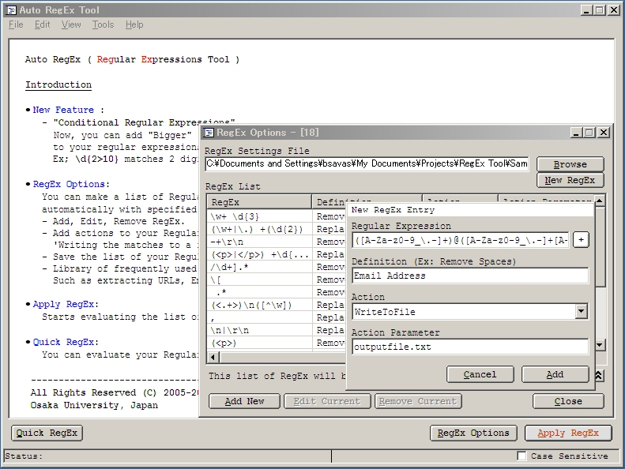



## Auto RegEx Tool

### Description

You can make a list of Regular Expressions and apply them one by one automatically with specified actions easily with this tools.

Actually, I developed this tool for formating Annotated Corpus text files.

Some features;

&#8226;	New Feature :

- "Conditional Regular Expressions"

Now, you can add "Bigger" &gt; or "Smaller" &lt; conditional operator

to your regular expressions for numbers.

Ex; \d{2&gt;10} matches 2 digit numbers bigger than 10.

&#8226;	RegEx Options:

You can make a list of Regular Expressions and apply them one by one

automatically with specified actions easily.

- Add, Edit, Remove RegEx.

- Add actions to your Regular Expressions like 'Replacing', 'Highlighting',

'Writing the matches to a file', 'Removing'.

- Save the list of your Regular Expressions for later use.

- Library of frequently used Regular Expressions ready to use.

Such as extracting URLs, Emails etc...

&#8226;	Apply RegEx:

Starts evaluating the list of Regular Expressions you've added one by one.

&#8226;	Quick RegEx:

You can evaluate your Regular Expressions quickly with this function.
 
### More Info
 
Plain Text

Requirements:

- Microsoft VBScript Regular Expressions 5.5 (vbscript.dll) installed.

Plain Text/File with actions listed done.

             |
---                |---
**Submitted On**   |2007-04-13 00:29:54
**By**             |[Bora Savas](https://github.com/Planet-Source-Code/PSCIndex/blob/master/ByAuthor/bora-savas.md)
**Level**          |Advanced
**User Rating**    |5.0 (15 globes from 3 users)
**Compatibility**  |VB 6\.0
**Category**       |[String Manipulation](https://github.com/Planet-Source-Code/PSCIndex/blob/master/ByCategory/string-manipulation__1-5.md)
**World**          |[Visual Basic](https://github.com/Planet-Source-Code/PSCIndex/blob/master/ByWorld/visual-basic.md)
**Archive File**   |[Auto\_RegEx2059914122007\.zip](https://github.com/Planet-Source-Code/bora-savas-auto-regex-tool__1-68339/archive/master.zip)

